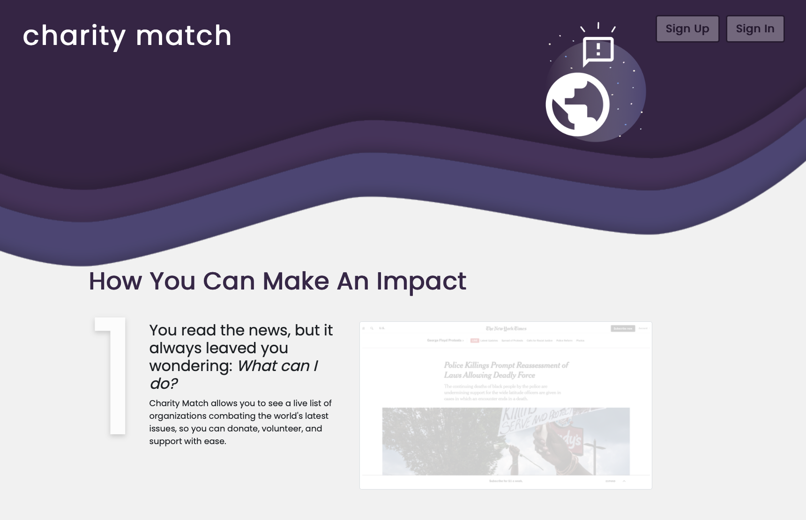
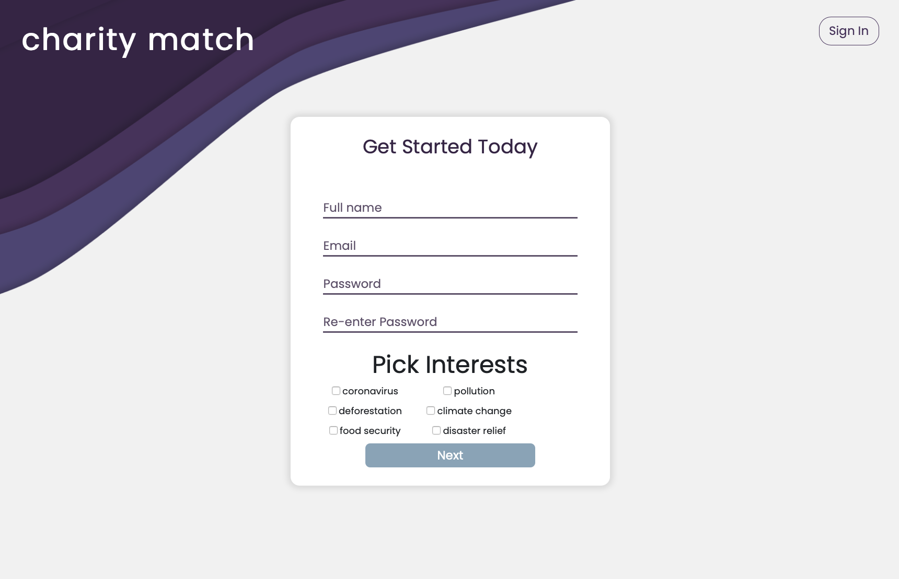
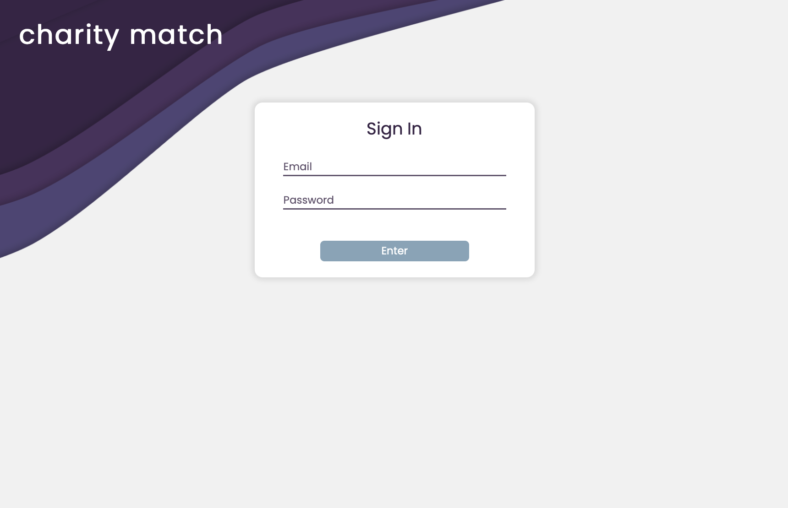
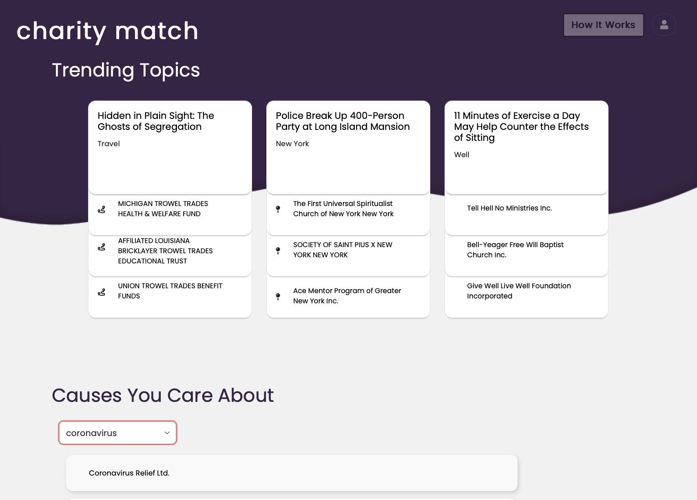
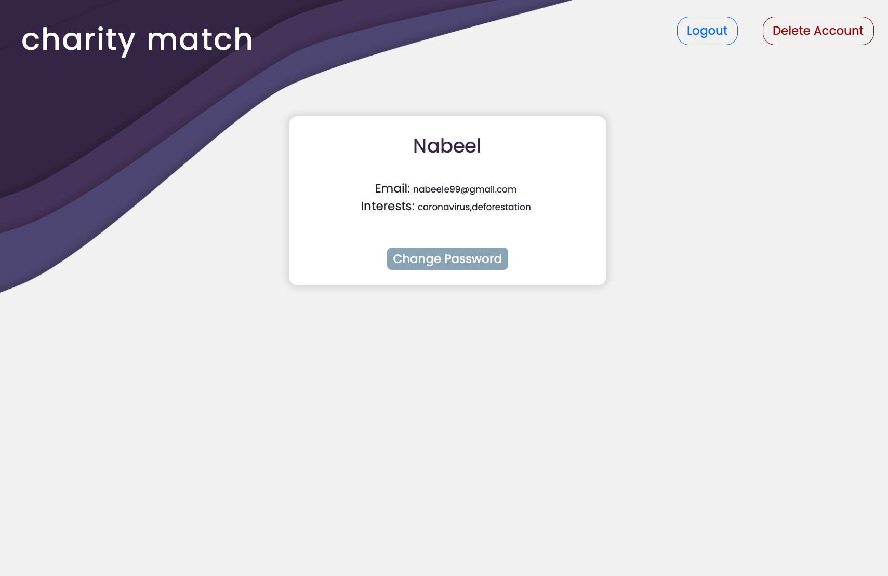
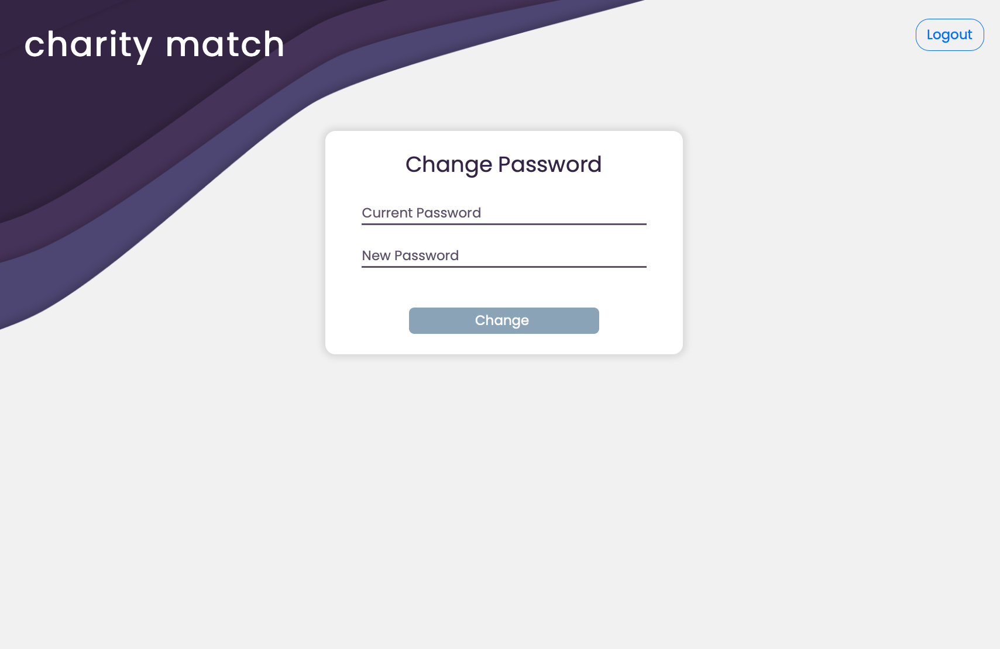

# Charity Match: https://charity--match.herokuapp.com/

<!-- The title should be your team name. -->
## Title: Tet

<!-- The subtitle should be your application name (if different from team name). -->
## Subtitle: Charity Match

## Semester: Fall 2020

## Overview:
<!-- A brief overview of your application. This will be based on what you are submitting as your final web application artifact. You should also mention why your application is innovative. -->

Charity Match is a website that provides the user with a live news feed of pressing world issues, and matches that directly to organizations that are helping solve that issue. The goal of this is to consolidate information about different charities, and also provide the direct connection between these charities and their causes.

Using the New York Times API to get the top stories of the day, we source charities and non-profits from the Charity Navigator API, which allows us to match current events to charities that are associated with them.

<!-- A list of your team members, with names and GitHub aliases. -->
## Team Members: 

Nabeel Eledroos - `nabeel-eledroos`

Jake Recoulle - `jdrecoulle0001`

## User Interface:
<!-- A final up-to-date list/table describing your application’s user interface. This should include the name of the UI view and its purpose. You should include a screenshot of each of your UI views. -->

| Name | Description | UI |
|-------|---------| ----|
| Landing Page (`/index.html`) | What the user first sees when they open Charity Match. |  |
| Sign Up (`/signup/sign_up.html`) | Sign Up Page, where user sets account info. |  |
| Sign In (`/signin/sign_in.html`) | Sign In Page, where user enters email and password. |  |
| App Page (`/app/app.html`) | Main app page, where article and charity content is displayed. |  |
| Account Page (`/user_account/my_account.html`) | Displays account info, allows user to logout or delete their account. |  |
| Change Password (`/user_account/change_pass.html`) | Allows user to change their password, accessible only from account page. |  |

<!-- A final up-to-date list/table describing your application’s API -->
## APIs:

### External

#### New York Times - Most Popular

This endpoint provides a json array with the most popular articles based on a defined metric (emails, shares, or views) and a specified time period (1, 7, or 30 days).

Example - getting the most viewed NYT articles in the past day:

`HTTP GET https://api.nytimes.com/svc/mostpopular/v2/viewed/1.json?api-key=${our_key}`

Example Response (some fields removed for the sake of brevity):

    ```
    {
        "status": "OK",
        "copyright": "Copyright (c) 2020 The New York Times Company.  All Rights Reserved.",
        "num_results": 20,
        "results": [
            {
                "uri": "nyt://article/8032db8d-078d-5433-b925-f5e7c0764a6b",
                "url": "https://www.nytimes.com/2020/11/03/us/politics/when-election-results.html",
                "id": 100000007428149,
                "published_date": "2020-11-03",
                "updated": "2020-11-04 13:45:21",
                "section": "U.S.",
                "subsection": "Politics",
                "adx_keywords": "Absentee Voting;Polls and Public Opinion;Electoral College;Presidential Election of 2020;Trump, Donald J;Biden, Joseph R Jr",
                "column": null,
                "byline": "By The New York Times",
                "type": "Article",
                "title": "When Will We Know the Election Results?",
                "abstract": "We don’t have a crystal ball. But here’s what we know about timing for election night.",
                "des_facet": [
                    "Absentee Voting",
                    "Polls and Public Opinion",
                    "Electoral College",
                    "Presidential Election of 2020"
                ],
                "per_facet": [
                    "Trump, Donald J",
                    "Biden, Joseph R Jr"
                ]
            }, 19 more results...]
    }
    ```
See here for more: [NYT API Documentation](https://developer.nytimes.com/apis)
#### Charity Navigator

The main endpoint is **Organizations**. This provides a list of all charity organizations in the database, and has a variety of search options to filter the results. After getting a list of articles from NYT, we search these organizations by article section, like so:

`HTTP GET https://api.data.charitynavigator.org/v2/Organizations?app_key=${our_key}&app_id=${my_id}&search=${article_section}`

Example response:

```
[
  {
    "charityNavigatorURL": "https://www.charitynavigator.org/?bay=search.summary&orgid=5954&utm_source=DataAPI&utm_content=b16336bb",
    "mission": "The MDI Biological Laboratory is a rapidly growing, independent non-profit biomedical research institution. Its mission is to improve human health and well-being through basic research, education, and development ventures that transform discoveries into cures.",
    "websiteURL": "http://www.mdibl.org/",
    "tagLine": "Connecting Science, Environment, and Health",
    "charityName": "Mount Desert Island Biological Laboratory",
    "ein": "010202467",
    "orgID": 5954,
    "currentRating": {
      "score": 94.62,
      "ratingID": 122841,
      "publicationDate": "2017-07-01T04:00:00.000Z",
      "rating": 4,
      "financialRating": {
        "score": 93.54,
        "rating": 4
      },
      "accountabilityRating": {
        "score": 96,
        "rating": 4
      }
    },...
```

See here for more: [Charity Navigator API Documentation](https://charity.3scale.net/docs/data-api/reference)
### Internal

1. Getting homepage:

  Request: `HTTP GET {url}/`

  Accessing the website sends a GET request to the server. The server handles this under the '/' request, which sends the client the landing page to load.

2. Signing Up with Charity Match

  Request: `HTTP GET/POST {url}/signup`

  The GET request, `{url}/signup`, returns the page to load.

  The POST request to `{url}/signup` adds a user to the database. The request is formatted as so:

    {
      first_name: req.body.first_name,
      last_name: req.body.last_name,
      id: req.body.id,
      password: req.body.password,
      interests: req.body.interests,
      charities: req.body.charities
    };


  On success, the server redirects the user to `{url}/signin` where they server will respond with the signin page.

3. Signing into Charity Match Account:

  Request: `HTTP GET/POST {url}/signin`

  The GET request is handled by the server responding with the page to load.

  The POST request to `{url}/signin` reads from the database to see if the user has an account. On success, the server redirects the client to `{url}/app`, where the server responds with the user's personal webpage. On failure, the server sends a 400 response indicating what went wrong.

4. User's Charity-Match Home Page:

  Request: `HTTP GET {url}/app`

  The client is redirected to make the GET request for the server to return the user's personal homepage. On failure, the server sends to the client a 400 status indicating a user has not been signed in. On load of the user's page, the client makes a GET request to the server responding with JSON of of the top news and most popular stories from the New York Times API, as described above.

5. Logging Out:

  Request: `HTTP GET {url}/logout`

  The GET request has the server destroy the user session and redirecting them to `{url}/`, where the server will send them back the landing page.

6. User's Account Page: 

  Request: `HTTP GET {url}/account`

  The GET request returns the user's information as JSON. The information is retrieved based on the user that is signed in. The information is structured as:

    {
      "first_name": Jeff,
      "last_name": Jon,
      "email":"MyNameisJeff@hotmail.com",
      "password":"BT0Wr7sMUwmK9vo",
      "interests": ["deforestation", "disasterRelief"],
      "charities": ["GoFundMe", "Wounded Warrior"]
    }

7. Change User Password:

  Request: `HTTP POST {url}/changePass`

  Body: `{ password: new_password }`

  The server handles this by checking to see if the associated user is logged in. If so, it finds the correct user in the database, and updates their password to the one in the request body, and then returns status 200.

8. Close User Account: 

  Request: `HTTP GET {url}/account` 

  The server handles this by checking to see if the user that wants to close the account is logged in. If so, it finds the user's information, and deletes it from the database, then redirects the client to `{url}/logout`.

9. Getting Top Stories:

  Request: `HTTP GET  {url}/topStories`

  The server reaches out to the New York Times API by making a GET request to the API, as described above. The data retrieved will be JSON which gets sent back to the client as JSON.

10. Getting Most Popular Stories: 
  Request: `HTTP GET  {url}/mostPopular`

  The server reaches out to the New York Times API, making a get request to the Most Popular API, as described above. The data retrieved will be JSON, in the format described prior, and be sent to the client as JSON.

11. Any other request:

  The server responds with a status of 404 and a message.

<!-- A final up-to-date representation of your database including a brief description of each of the entities in your data model and their relationships if any. -->
## Database: 

### Table: USERS
| Field       | Data Type | Description              |
|--------------|-----------|--------------------------|
| email  | String    | The email field of the users table serves as the primary key so each users(entry) is unique through email.  |
| password/salt | String/String   | The password of a user is encrypted with minicrypt by the server and stored in the salt and password fields. |
| name  | String    | This is simply the (full) name of the user.  |
| interests  | String Array    | This fields stores and array of interests, which the user will pick from when signing up.  |

<!-- | charities  | Int Array    | The user will have a list of charities which they are associated with. The charities from the Chavity Navigator API are referenced by ID, so this field stores the IDs as an array of integers.  | -->

<!-- A final up-to-date table of all the URL routes that your application supports and a short description of what those routes are used for. You should also indicate any authentication and permissions on those routes. -->
## URL Routes/Mappings: 
### URL Routes
| Route | Description |
|-------|-------------|
| GET '/' | Sends the landing page (index.html). |
| GET '/signup' | Sends the sign-up page (sign_up.html). |
| POST '/signup' | Takes information submitted by user and checks if an account exists under that email. If so, it sends an error message. If not, it hashes the password and adds the user to the database. |
| GET '/signin' | Sends sign-in page (sign_in.html). |
| POST '/signin' | Takes user email and password and runs the passport Local Strategy to check if the account exists and correct password. If so, the user is logged in and the request is rerouted to '/private' and if not, it routes to '/signin' again. |
| GET '/logout' | User is logged out via PassportJS and redirected to '/'. |
| GET '/private' | Checks if user is logged in then redirects to '/private/:userID/'. |
| GET '/private/:userID/' | Checks if user is logged in and sends the app page (app.html), if so. |
| GET '/my_account' | Checks if user is logged in and redirects to '/private/:userID/my_account'. |
| GET '/private/:userID/my_account' | Checks if user is logged in and if so, sends the user account page (my_account.html). |
| GET '/userInfo' | Checks if user logged in and if so, redirects to '/private/:userID/userInfo'. |
| GET '/private/:userID/userInfo' | Checks if user logged in and if so, it sends the user's account info retrieved from the database. |
| GET '/changePassPage' | Checks log in and redirects to '/private/:userID/change' on success. |
| GET '/private/:userID/change' | Checks log in and on success, sends the change password page (change_pass.html). |
| POST '/changePass' | Checks log in and on success, the new password is hashed with salt and saved to the database. The request is then redirected to '/sigin'. |
| GET '/closeAccount' | Checks log in and on success, redirects to '/private/:userID/closeAccount'. |
| GET '/private/:userID/closeAccount' | Checks user log in and on success, the user account is deleted from the database and the request is redirected to '/logout'. |
| GET '/topStories' | Retrieves info from NY Times API about the current top stories and responds to client with that info as JSON. |
| GET '/mostPopular' | Retrieves info from the NY Times API about the most popular stories and responds to client with that info as JSON. |
| POST '/charitySearch' | Retrieves charities from Charity Navigator API based on client interest parameter and responds with the info as JSON. |
| GET '/charities' | Retrieves all charities from Charity Navigator API and responds to client with info as JSON. |
| GET '*' | Redirects request to '/'. |


<!-- A final up-to-date description of how users are authenticated and any permissions for specific users (if any) that you used in your application. You should mention how they relate to which UI views are accessible. -->
## Authentication/Authorization: 

When signing up, user info is saved in the database with their email, which servers as a primary key, and their password, which is hashed with salt. Users are authenticated using PassportJS with a local strategy defined. The strategy first finds the user in the database, and if found, the password provided on sign in is hashed with salt and compared with the password stored in the database. If credentials provided are valid, the user is signed in with their email serving as the identifier. If not valid, the user must try again to sign in with the correct credentials or create an account. 

Users that are signed in will be able to access their app, account, and change password pages along with the ability to delete their account. The user is is also able to logout, which passport will handle on the request to the server.

## Division of Labor: 
<!-- A breakdown of the division of labor for each team member — that is, saying who did what, for the entire project. Remember that everyone is expected to contribute roughly equally to each phase of the project. We expect to see similar numbers and kinds of GitHub commits by each student. -->

| Member | Labor |
|-------|-------------|
| Nabeel Eledroos |  |
| Jake Recoulle | Implemented PostgreSQL database through Heroku to store user info. Drafted queries used to create, read, update, and delete (CRUD) users from the database. Wrote handlers for API calls to the server from the client to send appropriate files and info back to client. Wrote documentation for the all API calls. Added authentication and encryption for user validation and protection. Made framework for all our html files, created template for sign up pages, worked extensively on app page and landing page, worked on wireframes. |

## Conclusion: 
A conclusion describing your team’s experience in working on this project. This should include what you learned through the design and implementation process, the difficulties you encountered, what your team would have liked to know before starting the project that would have helped you later, and any other technical hurdles that your team encountered.


Starting off, we had some difficulty writing the basic html and css that we used as the template for the whole site. Styling the header and footer images were especially annoying, since they were hard to place and size correctly without messing up the rest of the page. However, once we had the html/css template done, it was pretty easy to build on top of it and keep adding pages, since we were able to copy/paste the template and work from there. Working with the external APIs also proved to be annoying. The Charity Navigator API was particularly frustrating because the information it returned is inconsistent between each charity, so we couldn’t display a lot of info about each one.

Writing the client-side javascript was also pretty easy, because we got a lot of practice in the lectures and homework for this class. Once we had the dummy server, transitioning to the actual SQL server wasn’t too hard, besides some initial difficulty we had in setting the table up. The actual code changes and queries weren’t too different from what we had before.

If we were able to continue working on this we would like to make some changes and add some new features. In terms of changes, we would like to make some small UI enhancements, mainly involving giving the user some feedback. For example, telling the user when there is a database/backend error, or giving them a confirmation once they’re signed in. Another potential UI change would be better formatting for mobile, as right now a lot of elements on the page overlap when the screen is smaller. As mentioned earlier, we would also like to get better information out of the Charity Navigator API to display for the user, as right now there isn't too much. Lastly, we would like to give users the ability to save charities, so that they can come back to their account and view them later.
