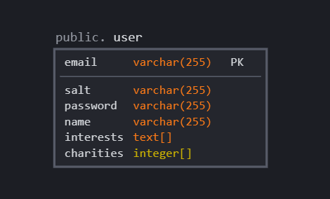

# Database Implementation
The database is implemented with **Heroku Postgres**. The database simply holds information about the users who signup with Charity Match. The table is designed as:

## Schema: public

## Table Name: user

## Fields:
<!-- ### Email
    The email field of the user table serves as the primary key so each user(entry) is unique through email.
### salt and password
    The password of a user is encrypted with minicrypt by the server and stored in the salt and password fields.
### name
    This is simply the (full) name of the user.
### interests
    This fields stores and array of interests, which the user will pick from when signing up.
### charities
    The user will have a list of charities which they are associated with. The charities from the Chavity Navigator API are referenced by ID, so this field stores the IDs as an array of integers. -->

| Field       | Data Type | Description              |
|--------------|-----------|--------------------------|
| email  | String    | The email field of the user table serves as the primary key so each user(entry) is unique through email.  |
| password/salt | String/String   | The password of a user is encrypted with minicrypt by the server and stored in the salt and password fields. |
| name  | String    | This is simply the (full) name of the user.  |
| interests  | String Array    | This fields stores and array of interests, which the user will pick from when signing up.  |
| charities  | Int Array    | The user will have a list of charities which they are associated with. The charities from the Chavity Navigator API are referenced by ID, so this field stores the IDs as an array of integers.  |

# Division of Labor

## Jake Recoulle: 
    Created the database and added the user table. Wrote up documentation for database. Implemented routing and sessions for user authentication using PassportJS and express-sessions.

## Nabeel Eledroos: 
    Wrote external API requests to NYT and Charity Navigator APIs, and wrote preliminary logic to render this data on the main app page. Also moved password change to new file, and cleaned up css.